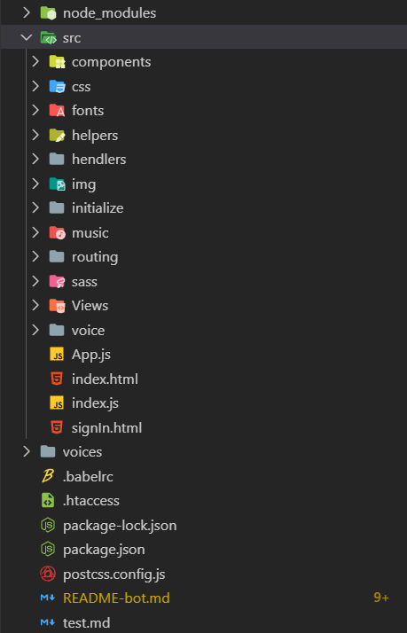
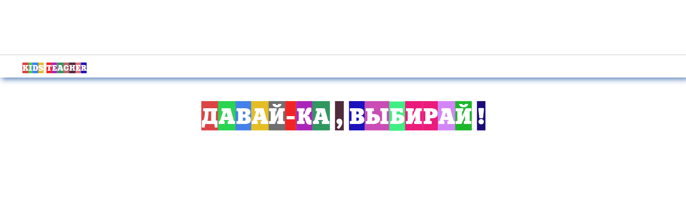
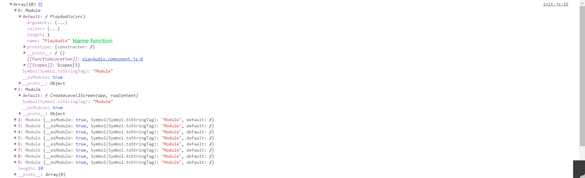
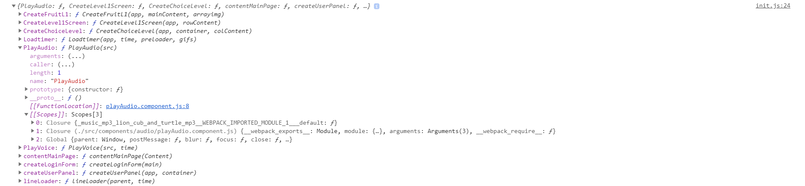

# Kids Teacher

## Educational game for the smallest children

### demo [KidsTeacher](http://github.com)

###### Current version alfa  `0.0.1`  added `19 november 2019`

## Tutorial:

> Application architecture

> How does the screen draw


> Routing - Router, RouterPath

> ImportALL - how to make this life easier


> Initialize — Why do I need an init file
### Application architecture 

 In future versions the application architecture `will change a lot`.
Most likely `components` will `replace` `template`  and `hendlers` will become `controllers`


>Actual application architecture (version 0.0.1alfa)


This is the architecture of the application




 Components —  component of the function responsible for rendering screens, playing music, and pictures in the transition between screens

The component consists of a function that accepts parent elements as parameters. Everything inside of these elements will be replaced. If this component is called

Example
```javascript
const CreateLevel1Screen = (app) => {
 const Screen1 = document.createElement('<div>')
    Screen1.id = 'screen1'
    Screen1.className  = 'screen1'
    app.appendChild(Screen1)
}
  
```
Helpers — Secondary functions . Which are reused many times. Making work easier and reducing code size

Example  function `CreateDOMElement`   this function save time on creating elements . and  `colorfulText` 
paints each letter of a string in a different color

```javascript

const = newComponent(parent) => {
const TitletextPropert = {
  id : 'letsPlayText',
  classList : 'letsPlayText',
  text :   'Давай-ка , выбирай !'
}

const TitleText = CreateDOMElement(TitletextPropert)

render(app, TitleText)

const titletext = document.getElementById('letsPlayText')

  colorfulText(titletext, 'title') 
}


  
```

result 



hendlers - function event handlers


### How does the screen draw


The input file to the application is index.js
Which contains a separate assistant function `render` This function puts the content of the application into a div with the root id. This is the only div that exists in `index.html` 

```javascript 
import app from './app.js'
//another import

    render(app, document.getElementById('root'))
```

#### App 
`app.js`  
* 1. Using the  Assistant Function `newDOM$EL`
 (this is old version func `createNewElement`)

 This func creates the root element of the entire application
* 2. The function of the component `CreateLoginForm`  is called and her parent(param) - ``app``.

* 3. Event handlers are hung on the created component

```javascript 
// import

   //init App
const App = newDOM$el('div' , 'app', [])

createLoginForm(App)

  


const body = document.querySelector('body')
//run after script App complete
window.onload = function(){

 
  // ! Constants for the operation of modules

 const vkbutton = document.getElementById('vkButton')
 const container = document.getElementById('container')
 const form = document.getElementsByClassName('formcard')
 const app    = App
 
 console.log(body)
//? Add Events
 const eventelem = [vkbutton]
 const preloader = document.getElementById('preloader')
   Loadtimer(app, 3000, preloader, gif1)
   LoginHendler(eventelem, app, container)
  
} 
export default App
```

* 4. Only the first screen contains a call to the handler function.
 
Since it must be created without user intervention. The following processing will be performed only after the corresponding user action

``Login hendler``

```javascript
import setHendler from './hendler.component'
import { RouterBase } from './../routing/Router'
import { StartGame } from './../routing/RoutersPath'


const LoginHendler = (elements) => {

  const reducer = (e) => {
    e = event.target
    switch(e.id){
      
      case 'vkButton' :
        StartGame()
        RouterBase.navigate('StartGame') 
        break
  }
}
  
  elements.forEach(element => {
      setHendler(element , 'click', false, reducer)
  })

}


export default LoginHendler
```
* each hendler file contains a sethendler helper function.
    
This function takes an array of their expectations on which to hang events.
And for each element applies function  ``reducer``    

* reducer function checks the id of the element with the condition

If id === condition id  transfers control ``Routing``

Navigate along the specified path and if the correct path the necessary component is drawn
``` javascript
    StartGame()  //Only executed if navigate === 'Start Game'
    RouterBase.navigate('StartGame') 
```

### Routing - Router, RouterPath

#### * Router  
##### ``Router.js``
The main routing system file is `router.js` All that is in this file is a ``Сlass router``.
 The router can work with both ``#`` hashes and ``broser history``

An instance of a router class is ``RouterBase``. All operations related to routing and drawing new application screens. Turning to him and his methods.
#### * RouterPath

##### ``RouterPATH.js``

 ``RouterPATH`` contains functions the call of which creates a new routerPATH and calls the initialize function.
 ```javascript
 import { RouterBase } from './Router'
import   init  from './../initialize/init'

// Routers path

 export const StartGame   = () => RouterBase.add(/^StartGame$/g , init.StartGame)

 export const ChoiceLevel = (app, container, colContent) => RouterBase.add(/^ChoiceLevel$/g , () => init.ChoiceLevel(app, container, colContent))

 export const Level1 = (app, container, colContent) => RouterBase.add(/^Level1$/g , () => init.Level1(app, container))

 ```
### ImportALL - how to make this life easier

The application already consists of a large number of components. And this is only alpha believed. To be able to use the function of a component from another file, we must import this file each time. And each time take care of its location. Specifying the wrong path for example ``../component/component.js`` instead of ``../../component/component.js``
И попытаемся запустить  `npm run start` 
our program will break. since put to file is not true.

And so we must be very careful with every file. Moreover, when creating a new file, we must import it again
####  Not! should no longer!

Based on this [guide](https://webpack.js.org/guides/dependency-management/) , the work of the next assistant function is built.

Consider the utility of a function using the example of the root file of the initialize system — `init.js`

```javascript
import {importAllHash} from './../helpers/importAll.helper'
//! Audio
import { voises } from './../voice/ru/script/voices'
import Audio from './../music/mp3/lion-cub-and-turtle.mp3'
//? gif
import  gif1 from './../img/Spinner-Preloader/dance_fruit_big.gif'


let componentsarr = []
let ComponentsArray =  importAllHash(require.context('./../components/', true, /\.js$/), componentsarr)

let hashComponent = Object.create(null)

ComponentsArray.forEach((component ,i) => {
  
  if(component.default !=  null || undefined){
    let keycomponent =  component.default.name
    hashComponent[keycomponent] = component.default
    
    console.log(component)

  }
})
let Components = hashComponent


//    <--START GAME SCREEN-->
 const initStartGame  = () => {
  const music =  Audio
  Components.PlayAudio(music)
  Components.createUserPanel(app, container) // тут не видит default  :=(
  Components.Loadtimer(app, 3000, Components.createUserPanel.Preloader(), gif1)
  Components.PlayVoice(voises.letsplayRussian, 3000)
  
}


//    <--CHOICE LEVEL  SCREEN-->
 const initChoiceLevel = (app, container, colContent ) => {
  console.log(app)
  if(container){
    container.innerHTML = ""
    
  }
   Components.PlayAudio.AudioStop()
   Components.PlayAudio(Audio)
   Components.CreateСhoiceLevel(app, container, colContent)
   Components.Loadtimer(app, 3000, Components.CreateСhoiceLevel.Preloader())
   Components.PlayVoice(voises.letsChooseALevel, 3000)
}

//    <-- LEVEL 1  SCREEN-->
  const initLevel1 = (app, container) => {
 
        
  Components.PlayAudio.AudioStop()
  Components.PlayAudio()
  Components.CreateLevel1Screen(app, container) 
  Components.Loadtimer(app, 3000, Components.CreateLevel1Screen.Preloader())
  Components.PlayVoice(voises.letsChooseAGroup, 3000)
}

const init = {
  StartGame : initStartGame,
  ChoiceLevel : (app, container, colContent) => initChoiceLevel(app, container, colContent),
  Level1  : (app, container, colContent) => initLevel1(app, container, colContent)
}

export default init
```

This file contains all initialization functions.
Each initialization function collects all the necessary functions into a screen for drawing the screen. Thus, an initialization function is a function that ``calls other functions``. This is done to facilitate the readability of ``helpers`` functions.


It’s possible to replace that this contains functions that render all screens however we don’t see them in the import


Instead, we see only one import `importAllHash`
```javascript
import {importAllHash} from './../helpers/importAll.helper'
```
This is a helper function that returns a hash from all the elements that are in the specified directory.

```javascript
let componentsarr = []
let ComponentsArray =  importAllHash(require.context('./../components/', true, /\.js$/), componentsarr)
```
Thus, we will always have an up-to-date array of components and we do not need to import the newly created file, it automatically gets into the array


this is how it looks in the browser





Good, but our components are in an ``array`` and not in an ``object``. Managing them through the array element number is simply pointless and extremely inconvenient. We need a unique key for each function.


The features of the function and the webpack.org guide end there.

Next come my work


* The first create an empty ``object``

* The second one we get through ``foreach`` on an array of components 

* The third We create the ``keys`` of our ``object`` and assign them the name of the corresponding component

* We assign to each ``element`` with a unique ``key`` the corresponding ``component``

Result 

```javascript
let hashComponent = Object.create(null)

ComponentsArray.forEach((component ,i) => {
  
  if(component.default !=  null || undefined){
    let keycomponent =  component.default.name
    hashComponent[keycomponent] = component.default
    
    console.log(component)

  }
})
let Components = hashComponent
```


This is how it looks in the browser




Fine. Now we have an ``object`` containing ``keys`` with the name of the ``component`` ``function``

Now we can access any ``component function``. Without importing it.

```javascript

components.PlayAudio(music) //like PlayAuido(music)


components.PlayAudio().stopAudio() //like PlayAuido().stopAudio
```


I find this a very useful tool. in the future, in my project there will be about 160 sound files and about 100 pictures. And they do not have to be imported separately

 ##### `20 november 2019`

